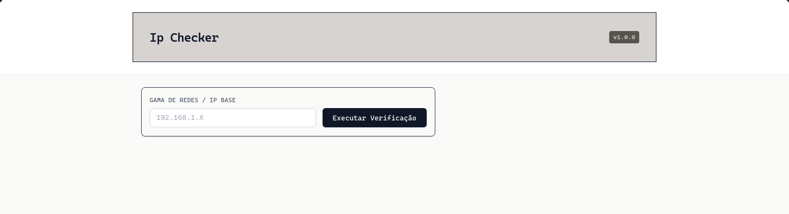
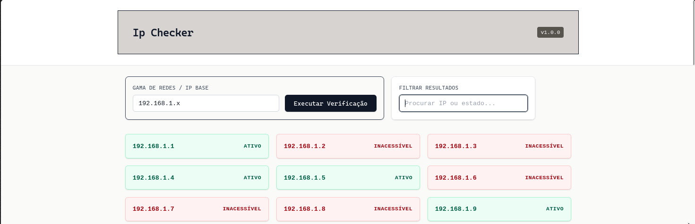
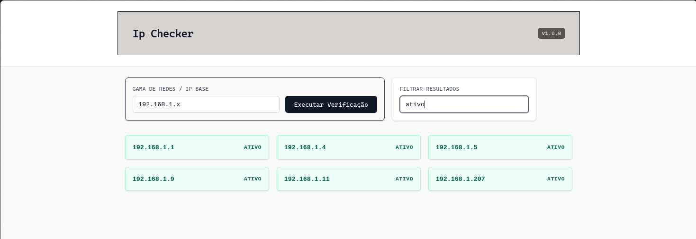
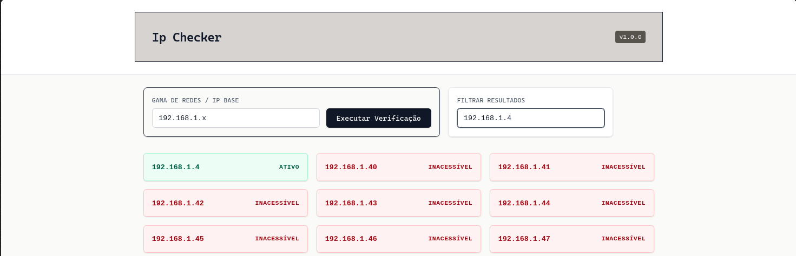

# IP Checker


Uma ferramenta web leve e minimalista desenvolvida em Go para varrimento, monitorização e verificação de disponibilidade de endereços IP em redes locais.

---

## Index

- [Funcionalidades](#funcionalidades)
- [Futuras Funcionalidades](#futuras-funcionalidades)
- [Fluxo de Utilização](#fluxo-de-utilização)
- [Opção 1: Executar via Binário (.exe)](#opção-1-executar-via-binário-exe---recomendado-para-utilizadores)
- [Opção 2: Executar Código Localmente](#opção-2-executar-código-localmente---recomendado-para-desenvolvedores)
- [Resolução de Problemas](#resolução-de-problemas)
- [Estrutura do Projeto](#estrutura-do-projeto)
- [API Endpoints](#api-endpoints)
- [Stack](#stack)
- [License](#license)

---

## Funcionalidades

- Varrimento automático a partir de um IP base/gama de rede.
- Interface web sóbria e responsiva (Tailwind CSS).
- Filtragem e pesquisa de resultados em tempo real (por IP ou estado).
- Atualização assíncrona sem recarregamento de página.

---

## Futuras funcionalidades

- [ ] Executável único
- [ ] Latência por ip
- [ ] Pesquisa por ipv6 inclusa

## Fluxo de Utilização

1. **Executar e abrir o navegador**
   Aceda a `http://localhost:8080` para ver o painel inicial.
   

2. **Pesquisar o IP atual**
   Introduza o IP base para iniciar o varrimento da rede.
   

3. **Filtragem de resultados**
   Pode refinar os resultados obtidos de duas formas:
   - **Por Estado:** Filtrar apenas os IPs com estado _Ativo_ ou _Inacessível_.
     
   - **Por IP:** Digitar parte do endereço para encontrar um dispositivo específico.
     

---

## Opção 1: Executar via Binário (.exe) - Recomendado para Utilizadores

> [!WARNING]
> V1.0 com erro, para resolver ver secção [Resolução de Problemas](#resolução-de-problemas).

> [!NOTE]
> Esta opção não requer que tenha o Go instalado no teu sistema.

1. Aceder à secção de **Releases** do repositório.
2. Descarregar o ficheiro `ip-checker.exe` mais recente.
3. Dar duplo clique em `ip-checker.exe`.
4. Abrir o navegador e aceder a: `http://localhost:8080`

---

## Opção 2: Executar Código Localmente - Recomendado para Desenvolvedores

Esta opção requer que tenhas o **Go 1.21+** instalado na tua máquina.

### 1. Clonar o Repositório

```bash
git clone https://github.com/Its-SMAC/IpsChecker.git
```

---

## Resolução de Problemas

### 1. Executável não funciona

```bash
    panic: html/template: pattern matches no files: `web/templates/*`
```

#### Como Resolver

Transferir o [Source Code(.zip)](https://github.com/Its-SMAC/IpsChecker/archive/refs/tags/Latest.zip), descompactar, introduzir o [.exe](https://github.com/Its-SMAC/IpsChecker/releases/download/Latest/ip-checker) no Source Code descompactado, e executar o ip-checker

---

## Estrutura do projeto

```text
.
├── cmd
│ └── main.go
├── go.mod
├── go.sum
├── internal
│ └── checker.go
├── LICENSE
├── README.md
└── web
├── static
│ └── js
│ └── script.js
└── templates
└── index.tmpl
```

---

## API Endpoints

O projeto utiliza a framework Gin para expor as seguintes rotas:

- **`GET` `/`**
  Retorna a interface web principal.

- **`POST` `/scan/ip`**
  Inicia o processo de varrimento da gama de IPs fornecida pelo frontend.

#### Exemplo de Log do Servidor (Gin)

```bash
[GIN] 2026/06/13 - 12:49:55 | 200 |    1.07s |       127.0.0.1 | POST     "/scan/ip"
```

---

## Stack

| Tecnologia                                                                                                              |   Tipo   | Função no Projeto                 |
| :---------------------------------------------------------------------------------------------------------------------- | :------: | :-------------------------------- |
|                                | Backend  | Servidor API e varrimento de rede |
|  | Frontend | Estilização sóbria da interface   |
|        | Frontend | Pedidos assíncronos e filtragem   |

---

## License

Esse projeto está sob licença. Veja o arquivo [LICENÇA](LICENSE) para mais detalhes.

---

> [!WARNING]
> **Disclaimer:** O IP Checker é um projeto pessoal em constante desenvolvimento. Podem ocorrer instabilidades ou falsos negativos dependendo das permissões de rede do sistema operativo utilizado. Sinta-se livre para modificar, alterar ou estudar o código.
>
> _Nota: A interface web visual foi inteiramente produzida com o auxílio da [IA Gemini](https://gemini.google.com)._
